# Base de Datos — Portal Web Institucional Alcaldía Municipal
**Versión:** 1.0 | **Gestión:** 2026
**Motor recomendado:** PostgreSQL 15+

---

## Índice de Módulos

| # | Módulo | Tablas |
|---|--------|--------|
| 1 | [Usuarios y Autenticación](#1-módulo-usuarios-y-autenticación) | usuarios, roles, permisos, roles_permisos, usuarios_roles, sesiones |
| 2 | [Configuración del Sitio](#2-módulo-configuración-del-sitio) | configuracion_sitio, menus, menu_items, banners, redes_sociales |
| 3 | [Autoridades e Institucional](#3-módulo-autoridades-e-institucional) | secretarias, autoridades, subsenefcos, organigrama |
| 4 | [Noticias y Comunicados](#4-módulo-noticias-y-comunicados) | categorias_noticia, etiquetas, noticias, comunicados, noticia_etiquetas, multimedia |
| 5 | [Agenda Institucional](#5-módulo-agenda-institucional) | tipos_evento, eventos |
| 6 | [Normativa](#6-módulo-normativa) | tipos_norma, normas |
| 7 | [Trámites y Servicios](#7-módulo-trámites-y-servicios) | unidades_responsables, tramites_catalogo, requisitos_tramite, formularios_tramite, tipos_tramite |
| 8 | [POA y Presupuesto](#8-módulo-poa-y-presupuesto) | planes_gobierno, poa, programas_poa, presupuestos, partidas_presupuestarias, ejecucion_presupuestaria |
| 9 | [Gobierno Abierto y Transparencia](#9-módulo-gobierno-abierto-y-transparencia) | categorias_indicador, indicadores_gestion, valores_indicador, documentos_transparencia, tipos_documento_transparencia |
| 10 | [Participación Ciudadana](#10-módulo-participación-ciudadana) | audiencias_publicas, consultas_ciudadanas, opciones_consulta, votos_consulta, sugerencias |
| 11 | [Solicitudes de Información Pública](#11-módulo-solicitudes-de-información-pública) | solicitudes_informacion, respuestas_informacion |
| 12 | [Contacto y Directorio](#12-módulo-contacto-y-directorio) | directorio_institucional, mensajes_contacto |
| 13 | [Recursos Humanos](#13-módulo-recursos-humanos) | manuales_institucionales, escala_salarial, nomina_personal |
| 14 | [Contenido Institucional](#14-módulo-contenido-institucional) | historia_municipio, himno, plan_estrategico_institucional, ejes_pei |
| 15 | [Auditorías](#15-módulo-auditorías) | tipos_auditoria, auditorias, hallazgos_auditoria |

---

## 1. Módulo: Usuarios y Autenticación

> Gestiona el acceso de ciudadanos, funcionarios y administradores al portal. Soporta roles y permisos granulares para el panel administrativo.

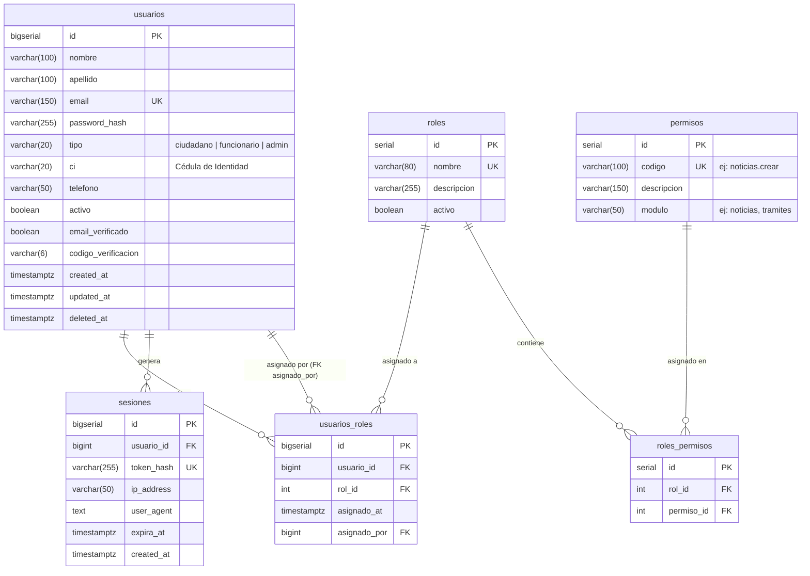
```mermaid
erDiagram
    usuarios {
        bigserial id PK
        varchar(100) nombre
        varchar(100) apellido
        varchar(150) email UK
        varchar(255) password_hash
        varchar(20) tipo "ciudadano | funcionario | admin"
        varchar(20) ci "Cédula de Identidad"
        varchar(50) telefono
        boolean activo
        boolean email_verificado
        varchar(6) codigo_verificacion
        timestamptz created_at
        timestamptz updated_at
        timestamptz deleted_at
    }

    roles {
        serial id PK
        varchar(80) nombre UK
        varchar(255) descripcion
        boolean activo
    }

    permisos {
        serial id PK
        varchar(100) codigo UK "ej: noticias.crear"
        varchar(150) descripcion
        varchar(50) modulo "ej: noticias, tramites"
    }

    roles_permisos {
        serial id PK
        int rol_id FK
        int permiso_id FK
    }

    usuarios_roles {
        bigserial id PK
        bigint usuario_id FK
        int rol_id FK
        timestamptz asignado_at
        bigint asignado_por FK
    }

    sesiones {
        bigserial id PK
        bigint usuario_id FK
        varchar(255) token_hash UK
        varchar(50) ip_address
        text user_agent
        timestamptz expira_at
        timestamptz created_at
    }

    usuarios ||--o{ usuarios_roles : "tiene"
    roles ||--o{ usuarios_roles : "asignado a"
    roles ||--o{ roles_permisos : "contiene"
    permisos ||--o{ roles_permisos : "asignado en"
    usuarios ||--o{ sesiones : "genera"
    usuarios ||--o{ usuarios_roles : "asignado por (FK asignado_por)"
```

### Descripción de tablas

| Tabla | Propósito |
|-------|-----------|
| `usuarios` | Almacena todos los usuarios del sistema: ciudadanos registrados, funcionarios y administradores de contenido |
| `roles` | Define perfiles de acceso (Ej: Admin, Editor de Noticias, Revisor de Trámites, Ciudadano) |
| `permisos` | Acciones específicas del sistema (crear, editar, eliminar por módulo) |
| `roles_permisos` | Tabla pivot que asigna múltiples permisos a cada rol |
| `usuarios_roles` | Asigna uno o varios roles a cada usuario, con trazabilidad de quién lo asignó |
| `sesiones` | Controla las sesiones activas para manejo de tokens JWT o de sesión segura |

---

## 2. Módulo: Configuración del Sitio

> Controla los elementos globales del portal: menús de navegación, banners del carrusel principal, redes sociales oficiales y parámetros del sistema.

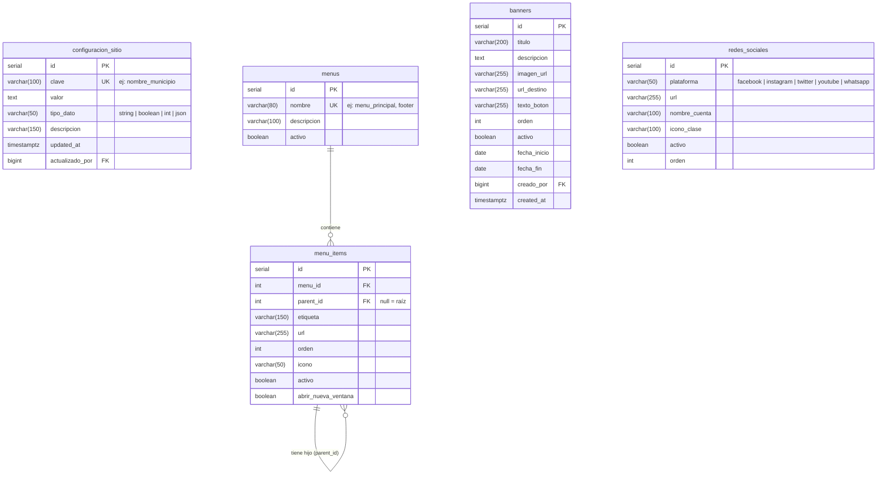
```mermaid
erDiagram
    configuracion_sitio {
        serial id PK
        varchar(100) clave UK "ej: nombre_municipio"
        text valor
        varchar(50) tipo_dato "string | boolean | int | json"
        varchar(150) descripcion
        timestamptz updated_at
        bigint actualizado_por FK
    }

    menus {
        serial id PK
        varchar(80) nombre UK "ej: menu_principal, footer"
        varchar(100) descripcion
        boolean activo
    }

    menu_items {
        serial id PK
        int menu_id FK
        int parent_id FK "null = raíz"
        varchar(150) etiqueta
        varchar(255) url
        int orden
        varchar(50) icono
        boolean activo
        boolean abrir_nueva_ventana
    }

    banners {
        serial id PK
        varchar(200) titulo
        text descripcion
        varchar(255) imagen_url
        varchar(255) url_destino
        varchar(255) texto_boton
        int orden
        boolean activo
        date fecha_inicio
        date fecha_fin
        bigint creado_por FK
        timestamptz created_at
    }

    redes_sociales {
        serial id PK
        varchar(50) plataforma "facebook | instagram | twitter | youtube | whatsapp"
        varchar(255) url
        varchar(100) nombre_cuenta
        varchar(100) icono_clase
        boolean activo
        int orden
    }

    menus ||--o{ menu_items : "contiene"
    menu_items ||--o{ menu_items : "tiene hijo (parent_id)"
```

### Descripción de tablas

| Tabla | Propósito |
|-------|-----------|
| `configuracion_sitio` | Parámetros globales del portal (nombre del municipio, logo, eslogan, colores, email de contacto, etc.) almacenados como clave-valor |
| `menus` | Define los menús del sitio (principal, footer, accesos rápidos) |
| `menu_items` | Ítems de cada menú con soporte de anidamiento (submenús) mediante `parent_id` |
| `banners` | Slides del carrusel/hero de la página de inicio con control de vigencia por fechas |
| `redes_sociales` | URLs y datos de las cuentas oficiales del municipio en redes sociales |

---

## 3. Módulo: Autoridades e Institucional

> Almacena la estructura orgánica del gobierno municipal: secretarías, autoridades, subalcaldías y el organigrama oficial.

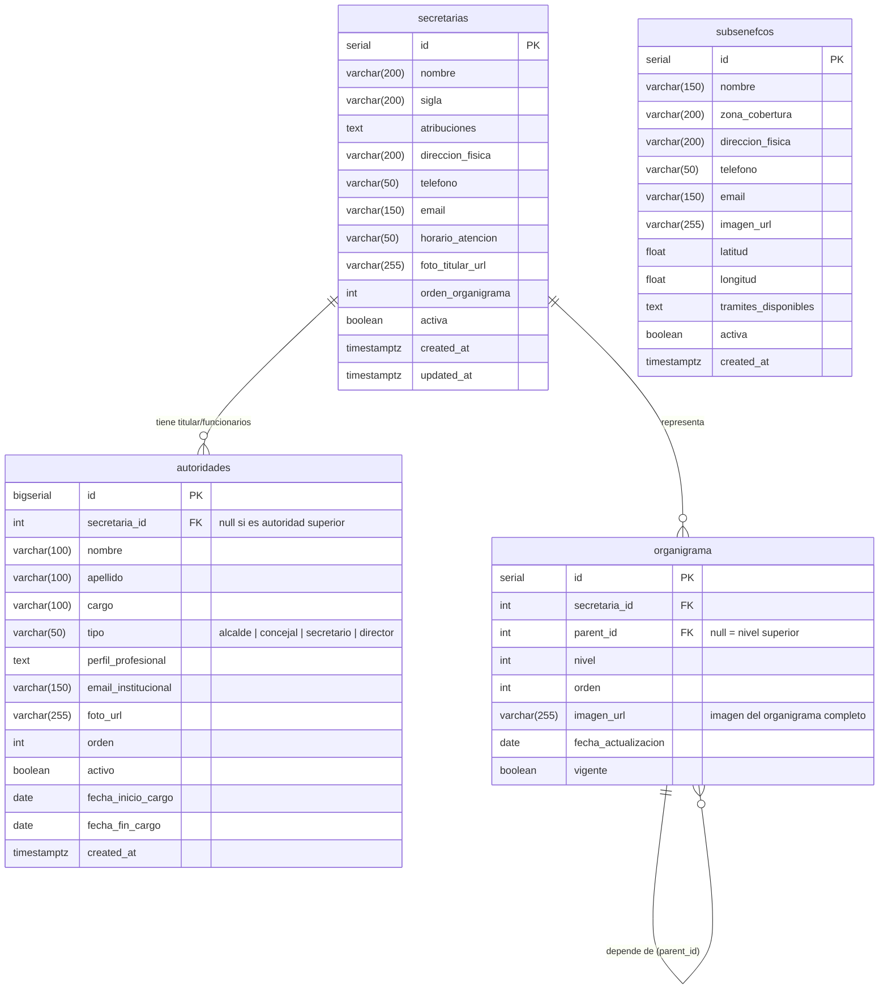
```mermaid
erDiagram
    secretarias {
        serial id PK
        varchar(200) nombre
        varchar(200) sigla
        text atribuciones
        varchar(200) direccion_fisica
        varchar(50) telefono
        varchar(150) email
        varchar(50) horario_atencion
        varchar(255) foto_titular_url
        int orden_organigrama
        boolean activa
        timestamptz created_at
        timestamptz updated_at
    }

    autoridades {
        bigserial id PK
        int secretaria_id FK "null si es autoridad superior"
        varchar(100) nombre
        varchar(100) apellido
        varchar(100) cargo
        varchar(50) tipo "alcalde | concejal | secretario | director"
        text perfil_profesional
        varchar(150) email_institucional
        varchar(255) foto_url
        int orden
        boolean activo
        date fecha_inicio_cargo
        date fecha_fin_cargo
        timestamptz created_at
    }

    subsenefcos {
        serial id PK
        varchar(150) nombre
        varchar(200) zona_cobertura
        varchar(200) direccion_fisica
        varchar(50) telefono
        varchar(150) email
        varchar(255) imagen_url
        float latitud
        float longitud
        text tramites_disponibles
        boolean activa
        timestamptz created_at
    }

    organigrama {
        serial id PK
        int secretaria_id FK
        int parent_id FK "null = nivel superior"
        int nivel
        int orden
        varchar(255) imagen_url "imagen del organigrama completo"
        date fecha_actualizacion
        boolean vigente
    }

    secretarias ||--o{ autoridades : "tiene titular/funcionarios"
    secretarias ||--o{ organigrama : "representa"
    organigrama ||--o{ organigrama : "depende de (parent_id)"
```

### Descripción de tablas

| Tabla | Propósito |
|-------|-----------|
| `secretarias` | Cada Secretaría Municipal o Unidad con sus datos de contacto y atribuciones |
| `autoridades` | Directorio de todas las autoridades (alcalde, concejales, secretarios, directores) con perfil y foto oficial |
| `subsenefcos` | Información de las subalcaldías/macrodistritos con geolocalización y trámites disponibles |
| `organigrama` | Estructura jerárquica institucional, permite construir el organigrama interactivo mediante relación padre-hijo |

---

## 4. Módulo: Noticias y Comunicados

> Gestiona todo el contenido informativo publicado: noticias institucionales, comunicados oficiales, galería multimedia y etiquetas.

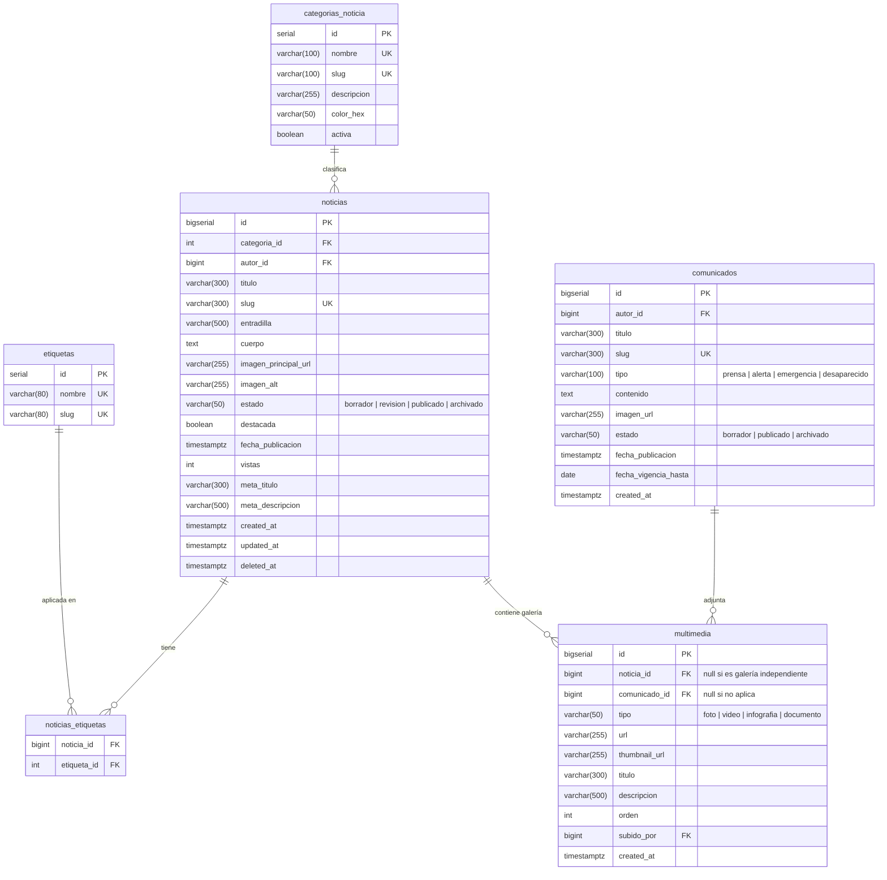
```mermaid
erDiagram
    categorias_noticia {
        serial id PK
        varchar(100) nombre UK
        varchar(100) slug UK
        varchar(255) descripcion
        varchar(50) color_hex
        boolean activa
    }

    etiquetas {
        serial id PK
        varchar(80) nombre UK
        varchar(80) slug UK
    }

    noticias {
        bigserial id PK
        int categoria_id FK
        bigint autor_id FK
        varchar(300) titulo
        varchar(300) slug UK
        varchar(500) entradilla
        text cuerpo
        varchar(255) imagen_principal_url
        varchar(255) imagen_alt
        varchar(50) estado "borrador | revision | publicado | archivado"
        boolean destacada
        timestamptz fecha_publicacion
        int vistas
        varchar(300) meta_titulo
        varchar(500) meta_descripcion
        timestamptz created_at
        timestamptz updated_at
        timestamptz deleted_at
    }

    noticias_etiquetas {
        bigint noticia_id FK
        int etiqueta_id FK
    }

    comunicados {
        bigserial id PK
        bigint autor_id FK
        varchar(300) titulo
        varchar(300) slug UK
        varchar(100) tipo "prensa | alerta | emergencia | desaparecido"
        text contenido
        varchar(255) imagen_url
        varchar(50) estado "borrador | publicado | archivado"
        timestamptz fecha_publicacion
        date fecha_vigencia_hasta
        timestamptz created_at
    }

    multimedia {
        bigserial id PK
        bigint noticia_id FK "null si es galería independiente"
        bigint comunicado_id FK "null si no aplica"
        varchar(50) tipo "foto | video | infografia | documento"
        varchar(255) url
        varchar(255) thumbnail_url
        varchar(300) titulo
        varchar(500) descripcion
        int orden
        bigint subido_por FK
        timestamptz created_at
    }

    categorias_noticia ||--o{ noticias : "clasifica"
    noticias ||--o{ noticias_etiquetas : "tiene"
    etiquetas ||--o{ noticias_etiquetas : "aplicada en"
    noticias ||--o{ multimedia : "contiene galería"
    comunicados ||--o{ multimedia : "adjunta"
```

### Descripción de tablas

| Tabla | Propósito |
|-------|-----------|
| `categorias_noticia` | Clasificación de noticias: obras, social, cultura, salud, seguridad, medio ambiente, etc. |
| `etiquetas` | Tags para búsqueda y navegación cruzada entre publicaciones |
| `noticias` | Publicaciones institucionales con flujo de estados (borrador → revisión → publicado), SEO y conteo de vistas |
| `noticias_etiquetas` | Relación muchos a muchos entre noticias y etiquetas |
| `comunicados` | Comunicados de prensa, alertas y avisos de emergencia o personas desaparecidas |
| `multimedia` | Galería centralizada de fotos, videos e infografías vinculables a noticias o comunicados |

---

## 5. Módulo: Agenda Institucional

> Registro del calendario de eventos oficiales del municipio.

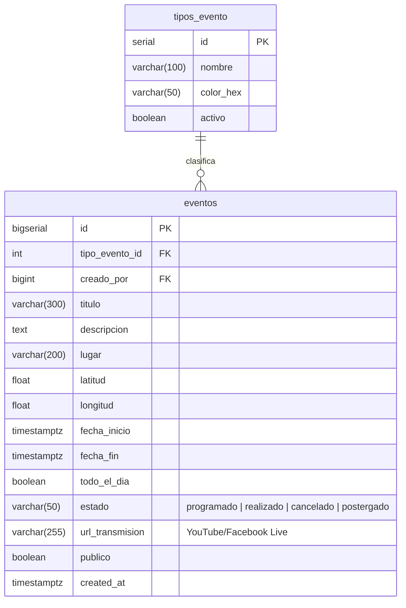
```mermaid
erDiagram
    tipos_evento {
        serial id PK
        varchar(100) nombre
        varchar(50) color_hex
        boolean activo
    }

    eventos {
        bigserial id PK
        int tipo_evento_id FK
        bigint creado_por FK
        varchar(300) titulo
        text descripcion
        varchar(200) lugar
        float latitud
        float longitud
        timestamptz fecha_inicio
        timestamptz fecha_fin
        boolean todo_el_dia
        varchar(50) estado "programado | realizado | cancelado | postergado"
        varchar(255) url_transmision "YouTube/Facebook Live"
        boolean publico
        timestamptz created_at
    }

    tipos_evento ||--o{ eventos : "clasifica"
```

### Descripción de tablas

| Tabla | Propósito |
|-------|-----------|
| `tipos_evento` | Categorías de eventos: audiencia pública, acto cívico, reunión del Concejo, evento cultural, etc. |
| `eventos` | Agenda detallada con fecha, lugar (incluyendo coordenadas), estado y enlace a transmisión en vivo |

---

## 6. Módulo: Normativa

> Repositorio digital de toda la normativa municipal: leyes autonómicas, decretos, resoluciones y reglamentos.

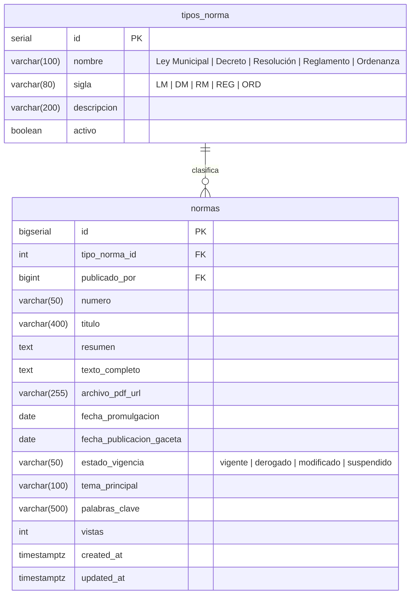
```mermaid
erDiagram
    tipos_norma {
        serial id PK
        varchar(100) nombre "Ley Municipal | Decreto | Resolución | Reglamento | Ordenanza"
        varchar(80) sigla "LM | DM | RM | REG | ORD"
        varchar(200) descripcion
        boolean activo
    }

    normas {
        bigserial id PK
        int tipo_norma_id FK
        bigint publicado_por FK
        varchar(50) numero
        varchar(400) titulo
        text resumen
        text texto_completo
        varchar(255) archivo_pdf_url
        date fecha_promulgacion
        date fecha_publicacion_gaceta
        varchar(50) estado_vigencia "vigente | derogado | modificado | suspendido"
        varchar(100) tema_principal
        varchar(500) palabras_clave
        int vistas
        timestamptz created_at
        timestamptz updated_at
    }

    tipos_norma ||--o{ normas : "clasifica"
```

### Descripción de tablas

| Tabla | Propósito |
|-------|-----------|
| `tipos_norma` | Tipología normativa (Ley Municipal Autonómica, Decreto Municipal, Resolución Ejecutiva/Concejo, Reglamento, Ordenanza) |
| `normas` | Texto completo de cada norma con metadatos para el buscador (número, fecha, palabras clave, estado de vigencia) |

---

## 7. Módulo: Trámites y Servicios

> Catálogo de todos los trámites municipales disponibles, con requisitos, costos y unidades responsables.

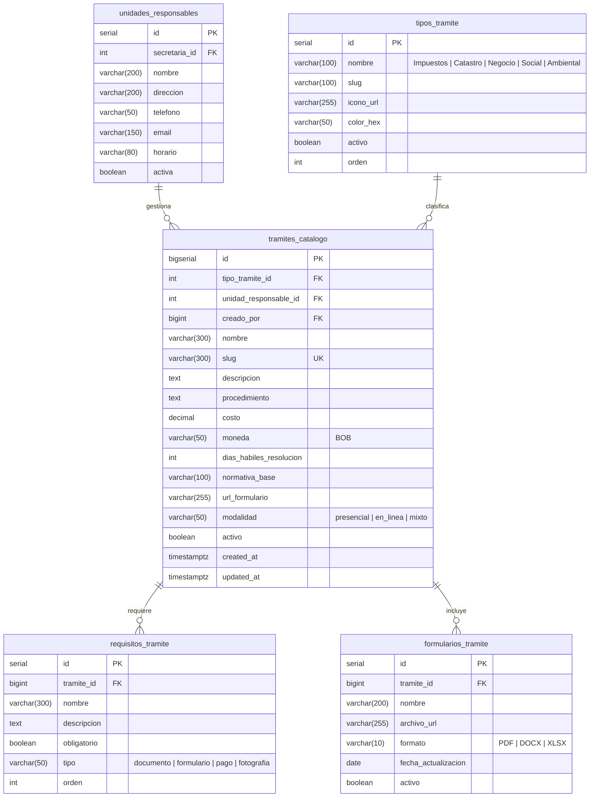
```mermaid
erDiagram
    unidades_responsables {
        serial id PK
        int secretaria_id FK
        varchar(200) nombre
        varchar(200) direccion
        varchar(50) telefono
        varchar(150) email
        varchar(80) horario
        boolean activa
    }

    tipos_tramite {
        serial id PK
        varchar(100) nombre "Impuestos | Catastro | Negocio | Social | Ambiental"
        varchar(100) slug
        varchar(255) icono_url
        varchar(50) color_hex
        boolean activo
        int orden
    }

    tramites_catalogo {
        bigserial id PK
        int tipo_tramite_id FK
        int unidad_responsable_id FK
        bigint creado_por FK
        varchar(300) nombre
        varchar(300) slug UK
        text descripcion
        text procedimiento
        decimal costo
        varchar(50) moneda "BOB"
        int dias_habiles_resolucion
        varchar(100) normativa_base
        varchar(255) url_formulario
        varchar(50) modalidad "presencial | en_linea | mixto"
        boolean activo
        timestamptz created_at
        timestamptz updated_at
    }

    requisitos_tramite {
        serial id PK
        bigint tramite_id FK
        varchar(300) nombre
        text descripcion
        boolean obligatorio
        varchar(50) tipo "documento | formulario | pago | fotografia"
        int orden
    }

    formularios_tramite {
        serial id PK
        bigint tramite_id FK
        varchar(200) nombre
        varchar(255) archivo_url
        varchar(10) formato "PDF | DOCX | XLSX"
        date fecha_actualizacion
        boolean activo
    }

    unidades_responsables ||--o{ tramites_catalogo : "gestiona"
    tipos_tramite ||--o{ tramites_catalogo : "clasifica"
    tramites_catalogo ||--o{ requisitos_tramite : "requiere"
    tramites_catalogo ||--o{ formularios_tramite : "incluye"
```

### Descripción de tablas

| Tabla | Propósito |
|-------|-----------|
| `unidades_responsables` | Cada ventanilla o unidad que procesa trámites específicos |
| `tipos_tramite` | Agrupación visual de trámites para los accesos rápidos del Home (Impuestos, Catastro, Negocios, Social, etc.) |
| `tramites_catalogo` | Ficha completa de cada trámite: descripción, costo, plazo, modalidad de atención |
| `requisitos_tramite` | Lista ordenada de requisitos por trámite, clasificados por tipo |
| `formularios_tramite` | Formularios descargables asociados a cada trámite |

---

## 8. Módulo: POA y Presupuesto

> Planificación y seguimiento financiero: Plan de Gobierno, Plan Operativo Anual y ejecución presupuestaria.

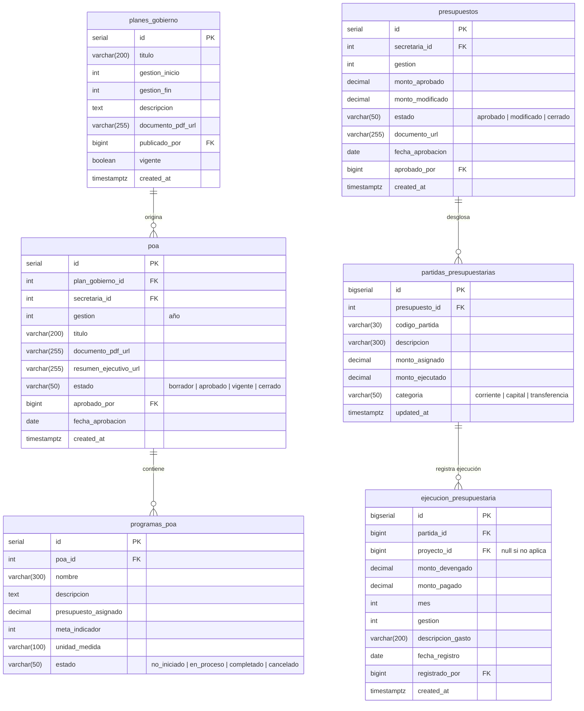
```mermaid
erDiagram
    planes_gobierno {
        serial id PK
        varchar(200) titulo
        int gestion_inicio
        int gestion_fin
        text descripcion
        varchar(255) documento_pdf_url
        bigint publicado_por FK
        boolean vigente
        timestamptz created_at
    }

    poa {
        serial id PK
        int plan_gobierno_id FK
        int secretaria_id FK
        int gestion "año"
        varchar(200) titulo
        varchar(255) documento_pdf_url
        varchar(255) resumen_ejecutivo_url
        varchar(50) estado "borrador | aprobado | vigente | cerrado"
        bigint aprobado_por FK
        date fecha_aprobacion
        timestamptz created_at
    }

    programas_poa {
        serial id PK
        int poa_id FK
        varchar(300) nombre
        text descripcion
        decimal presupuesto_asignado
        int meta_indicador
        varchar(100) unidad_medida
        varchar(50) estado "no_iniciado | en_proceso | completado | cancelado"
    }

    presupuestos {
        serial id PK
        int secretaria_id FK
        int gestion
        decimal monto_aprobado
        decimal monto_modificado
        varchar(50) estado "aprobado | modificado | cerrado"
        varchar(255) documento_url
        date fecha_aprobacion
        bigint aprobado_por FK
        timestamptz created_at
    }

    partidas_presupuestarias {
        bigserial id PK
        int presupuesto_id FK
        varchar(30) codigo_partida
        varchar(300) descripcion
        decimal monto_asignado
        decimal monto_ejecutado
        varchar(50) categoria "corriente | capital | transferencia"
        timestamptz updated_at
    }

    ejecucion_presupuestaria {
        bigserial id PK
        bigint partida_id FK
        bigint proyecto_id FK "null si no aplica"
        decimal monto_devengado
        decimal monto_pagado
        int mes
        int gestion
        varchar(200) descripcion_gasto
        date fecha_registro
        bigint registrado_por FK
        timestamptz created_at
    }

    planes_gobierno ||--o{ poa : "origina"
    poa ||--o{ programas_poa : "contiene"
    presupuestos ||--o{ partidas_presupuestarias : "desglosa"
    partidas_presupuestarias ||--o{ ejecucion_presupuestaria : "registra ejecución"
```

### Descripción de tablas

| Tabla | Propósito |
|-------|-----------|
| `planes_gobierno` | Plan de gobierno de la gestión vigente con ejes estratégicos |
| `poa` | Plan Operativo Anual por secretaría y gestión, vinculado al plan de gobierno |
| `programas_poa` | Programas y metas específicas dentro de cada POA con indicadores de avance |
| `presupuestos` | Presupuesto aprobado y sus modificaciones por secretaría y gestión |
| `partidas_presupuestarias` | Desglose del presupuesto en partidas con montos asignados y ejecutados |
| `ejecucion_presupuestaria` | Registro mensual de gastos reales por partida para los informes de transparencia |

---

## 9. Módulo: Gobierno Abierto y Transparencia

> Indicadores de gestión, documentos de transparencia y datos abiertos para el dashboard ciudadano.

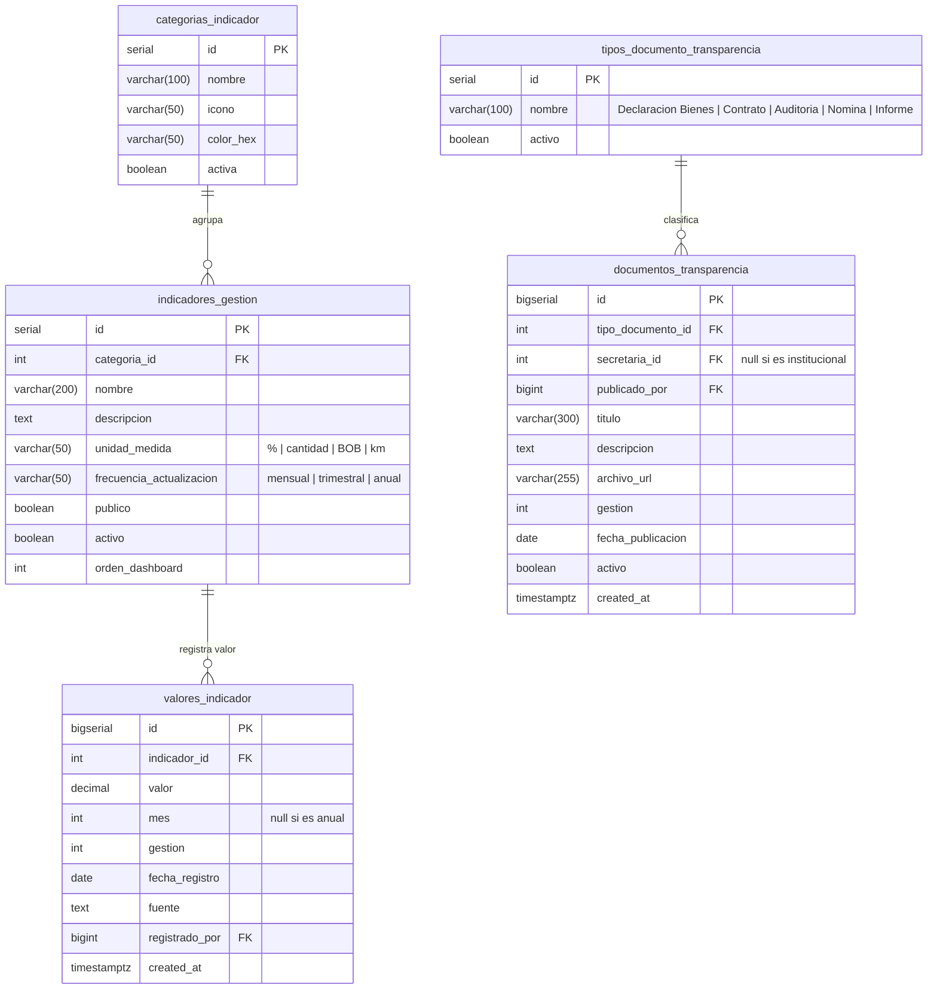
```mermaid
erDiagram
    categorias_indicador {
        serial id PK
        varchar(100) nombre
        varchar(50) icono
        varchar(50) color_hex
        boolean activa
    }

    indicadores_gestion {
        serial id PK
        int categoria_id FK
        varchar(200) nombre
        text descripcion
        varchar(50) unidad_medida "% | cantidad | BOB | km"
        varchar(50) frecuencia_actualizacion "mensual | trimestral | anual"
        boolean publico
        boolean activo
        int orden_dashboard
    }

    valores_indicador {
        bigserial id PK
        int indicador_id FK
        decimal valor
        int mes "null si es anual"
        int gestion
        date fecha_registro
        text fuente
        bigint registrado_por FK
        timestamptz created_at
    }

    tipos_documento_transparencia {
        serial id PK
        varchar(100) nombre "Declaracion Bienes | Contrato | Auditoria | Nomina | Informe"
        boolean activo
    }

    documentos_transparencia {
        bigserial id PK
        int tipo_documento_id FK
        int secretaria_id FK "null si es institucional"
        bigint publicado_por FK
        varchar(300) titulo
        text descripcion
        varchar(255) archivo_url
        int gestion
        date fecha_publicacion
        boolean activo
        timestamptz created_at
    }

    categorias_indicador ||--o{ indicadores_gestion : "agrupa"
    indicadores_gestion ||--o{ valores_indicador : "registra valor"
    tipos_documento_transparencia ||--o{ documentos_transparencia : "clasifica"
```

### Descripción de tablas

| Tabla | Propósito |
|-------|-----------|
| `categorias_indicador` | Grupos temáticos para el dashboard: Finanzas, Obras, Servicios, Educación, Salud |
| `indicadores_gestion` | Definición de cada KPI del panel de gobierno abierto con frecuencia de actualización |
| `valores_indicador` | Serie histórica de valores por indicador para generar gráficas de tendencia |
| `tipos_documento_transparencia` | Clasificación de documentos: declaraciones de bienes, contratos, auditorías, nóminas |
| `documentos_transparencia` | Documentos públicos descargables en la sección de transparencia institucional |

---

## 10. Módulo: Participación Ciudadana

> Mecanismos de interacción entre la ciudadanía y el gobierno municipal.

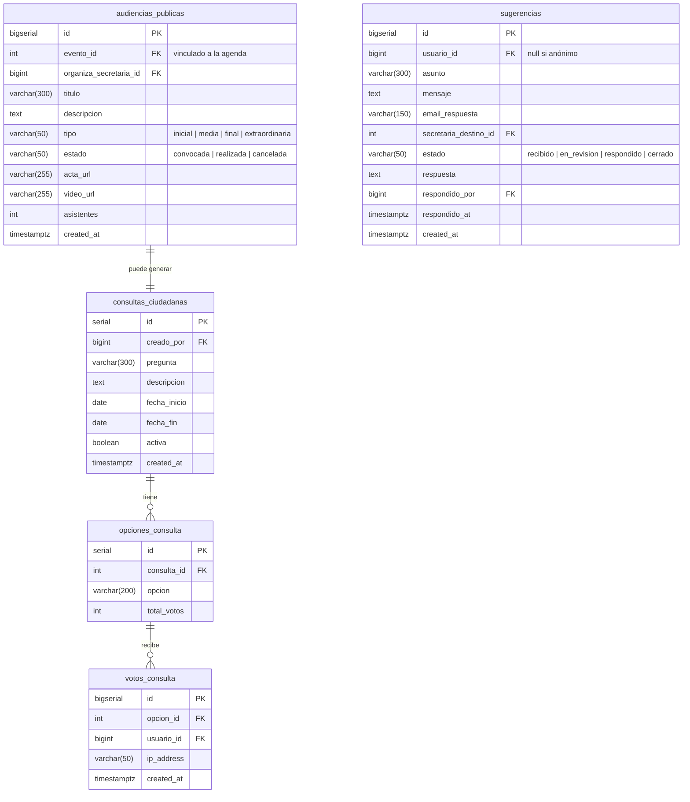
```mermaid
erDiagram
    audiencias_publicas {
        bigserial id PK
        int evento_id FK "vinculado a la agenda"
        bigint organiza_secretaria_id FK
        varchar(300) titulo
        text descripcion
        varchar(50) tipo "inicial | media | final | extraordinaria"
        varchar(50) estado "convocada | realizada | cancelada"
        varchar(255) acta_url
        varchar(255) video_url
        int asistentes
        timestamptz created_at
    }

    consultas_ciudadanas {
        serial id PK
        bigint creado_por FK
        varchar(300) pregunta
        text descripcion
        date fecha_inicio
        date fecha_fin
        boolean activa
        timestamptz created_at
    }

    opciones_consulta {
        serial id PK
        int consulta_id FK
        varchar(200) opcion
        int total_votos
    }

    votos_consulta {
        bigserial id PK
        int opcion_id FK
        bigint usuario_id FK
        varchar(50) ip_address
        timestamptz created_at
    }

    sugerencias {
        bigserial id PK
        bigint usuario_id FK "null si anónimo"
        varchar(300) asunto
        text mensaje
        varchar(150) email_respuesta
        int secretaria_destino_id FK
        varchar(50) estado "recibido | en_revision | respondido | cerrado"
        text respuesta
        bigint respondido_por FK
        timestamptz respondido_at
        timestamptz created_at
    }

    audiencias_publicas ||--|| consultas_ciudadanas : "puede generar"
    consultas_ciudadanas ||--o{ opciones_consulta : "tiene"
    opciones_consulta ||--o{ votos_consulta : "recibe"
```

### Descripción de tablas

| Tabla | Propósito |
|-------|-----------|
| `audiencias_publicas` | Registro de audiencias de rendición de cuentas (inicial, media, final) con actas y videos |
| `consultas_ciudadanas` | Encuestas o consultas digitales para captar opinión ciudadana sobre temas municipales |
| `opciones_consulta` | Opciones de respuesta para cada consulta con contador de votos agregado |
| `votos_consulta` | Voto individual por ciudadano (1 voto por usuario/IP para evitar duplicados) |
| `sugerencias` | Buzón virtual de sugerencias y comentarios ciudadanos con trazabilidad de respuesta |

---

## 11. Módulo: Solicitudes de Información Pública

> Canal para solicitar información pública según la normativa de transparencia (Ley 045 y Ley de Transparencia).

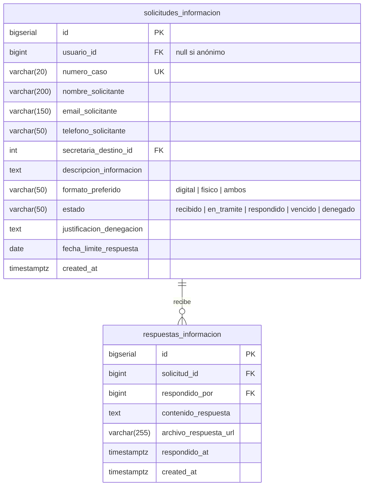
```mermaid
erDiagram
    solicitudes_informacion {
        bigserial id PK
        bigint usuario_id FK "null si anónimo"
        varchar(20) numero_caso UK
        varchar(200) nombre_solicitante
        varchar(150) email_solicitante
        varchar(50) telefono_solicitante
        int secretaria_destino_id FK
        text descripcion_informacion
        varchar(50) formato_preferido "digital | fisico | ambos"
        varchar(50) estado "recibido | en_tramite | respondido | vencido | denegado"
        text justificacion_denegacion
        date fecha_limite_respuesta
        timestamptz created_at
    }

    respuestas_informacion {
        bigserial id PK
        bigint solicitud_id FK
        bigint respondido_por FK
        text contenido_respuesta
        varchar(255) archivo_respuesta_url
        timestamptz respondido_at
        timestamptz created_at
    }

    solicitudes_informacion ||--o{ respuestas_informacion : "recibe"
```

### Descripción de tablas

| Tabla | Propósito |
|-------|-----------|
| `solicitudes_informacion` | Solicitudes ciudadanas de acceso a información pública con número de caso y plazo legal de respuesta |
| `respuestas_informacion` | Respuestas institucionales a las solicitudes con documentos adjuntos |

---

## 12. Módulo: Contacto y Directorio

> Directorio institucional de unidades y gestión de mensajes ciudadanos entrantes.

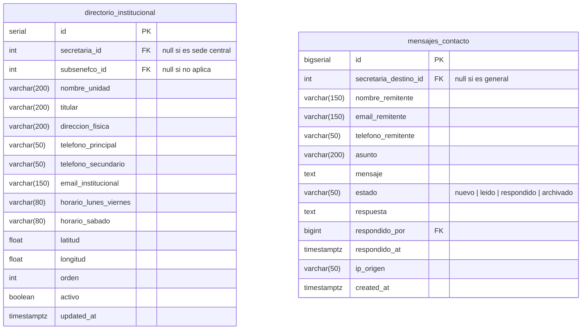
```mermaid
erDiagram
    directorio_institucional {
        serial id PK
        int secretaria_id FK "null si es sede central"
        int subsenefco_id FK "null si no aplica"
        varchar(200) nombre_unidad
        varchar(200) titular
        varchar(200) direccion_fisica
        varchar(50) telefono_principal
        varchar(50) telefono_secundario
        varchar(150) email_institucional
        varchar(80) horario_lunes_viernes
        varchar(80) horario_sabado
        float latitud
        float longitud
        int orden
        boolean activo
        timestamptz updated_at
    }

    mensajes_contacto {
        bigserial id PK
        int secretaria_destino_id FK "null si es general"
        varchar(150) nombre_remitente
        varchar(150) email_remitente
        varchar(50) telefono_remitente
        varchar(200) asunto
        text mensaje
        varchar(50) estado "nuevo | leido | respondido | archivado"
        text respuesta
        bigint respondido_por FK
        timestamptz respondido_at
        varchar(50) ip_origen
        timestamptz created_at
    }
```

### Descripción de tablas

| Tabla | Propósito |
|-------|-----------|
| `directorio_institucional` | Datos de contacto completos de cada unidad/secretaría con horarios y geolocalización para el mapa |
| `mensajes_contacto` | Mensajes recibidos a través del formulario de contacto del portal con gestión de respuesta |

---

## 13. Módulo: Recursos Humanos

> Gestión documental del personal municipal: manuales institucionales, escala salarial y nómina de autoridades y funcionarios. Visible en la sección **Recursos Humanos** del portal.

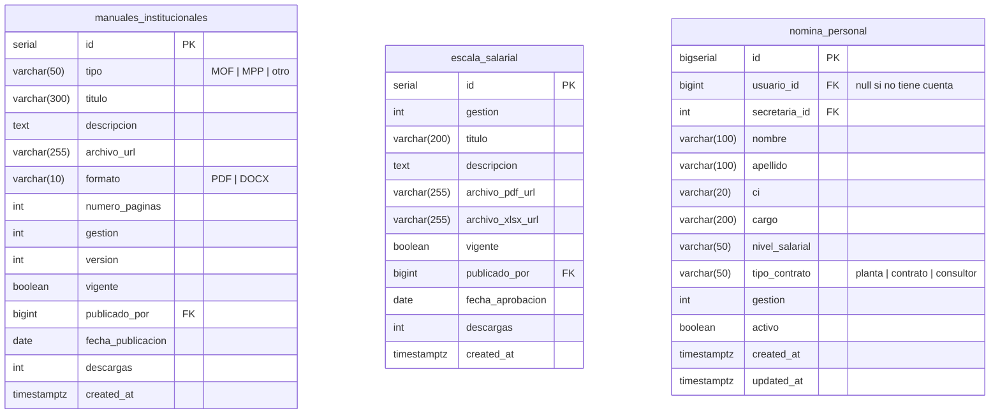
```mermaid
erDiagram
    manuales_institucionales {
        serial id PK
        varchar(50) tipo "MOF | MPP | otro"
        varchar(300) titulo
        text descripcion
        varchar(255) archivo_url
        varchar(10) formato "PDF | DOCX"
        int numero_paginas
        int gestion
        int version
        boolean vigente
        bigint publicado_por FK
        date fecha_publicacion
        int descargas
        timestamptz created_at
    }

    escala_salarial {
        serial id PK
        int gestion
        varchar(200) titulo
        text descripcion
        varchar(255) archivo_pdf_url
        varchar(255) archivo_xlsx_url
        boolean vigente
        bigint publicado_por FK
        date fecha_aprobacion
        int descargas
        timestamptz created_at
    }

    nomina_personal {
        bigserial id PK
        bigint usuario_id FK "null si no tiene cuenta"
        int secretaria_id FK
        varchar(100) nombre
        varchar(100) apellido
        varchar(20) ci
        varchar(200) cargo
        varchar(50) nivel_salarial
        varchar(50) tipo_contrato "planta | contrato | consultor"
        int gestion
        boolean activo
        timestamptz created_at
        timestamptz updated_at
    }
```

### Descripción de tablas

| Tabla | Propósito |
| ----- | --------- |
| `manuales_institucionales` | Almacena el Manual de Organización y Funciones (MOF) y el Manual de Procesos y Procedimientos (MPP), versionados por gestión |
| `escala_salarial` | Escala salarial aprobada por gestión, disponible para descarga pública en PDF y XLSX |
| `nomina_personal` | Nómina de funcionarios y autoridades publicada en transparencia, filtrable por secretaría y gestión |

---

## 14. Módulo: Contenido Institucional

> Páginas de identidad y planificación estratégica del municipio: Historia, Himno, Plan Estratégico Institucional (PEI). Visible bajo **Comunicación** e **Institucional** del menú.

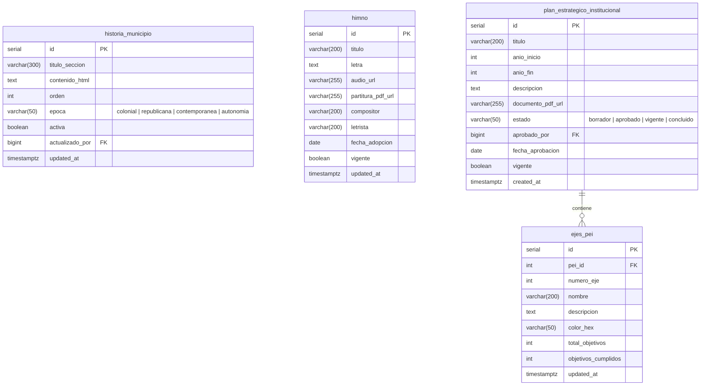
```mermaid
erDiagram
    historia_municipio {
        serial id PK
        varchar(300) titulo_seccion
        text contenido_html
        int orden
        varchar(50) epoca "colonial | republicana | contemporanea | autonomia"
        boolean activa
        bigint actualizado_por FK
        timestamptz updated_at
    }

    himno {
        serial id PK
        varchar(200) titulo
        text letra
        varchar(255) audio_url
        varchar(255) partitura_pdf_url
        varchar(200) compositor
        varchar(200) letrista
        date fecha_adopcion
        boolean vigente
        timestamptz updated_at
    }

    plan_estrategico_institucional {
        serial id PK
        varchar(200) titulo
        int anio_inicio
        int anio_fin
        text descripcion
        varchar(255) documento_pdf_url
        varchar(50) estado "borrador | aprobado | vigente | concluido"
        bigint aprobado_por FK
        date fecha_aprobacion
        boolean vigente
        timestamptz created_at
    }

    ejes_pei {
        serial id PK
        int pei_id FK
        int numero_eje
        varchar(200) nombre
        text descripcion
        varchar(50) color_hex
        int total_objetivos
        int objetivos_cumplidos
        timestamptz updated_at
    }

    plan_estrategico_institucional ||--o{ ejes_pei : "contiene"
```

### Descripción de tablas

| Tabla | Propósito |
| ----- | --------- |
| `historia_municipio` | Contenido de la página Historia organizado por épocas, editable desde el panel de administración |
| `himno` | Letra, audio y partitura del himno municipal con datos del compositor |
| `plan_estrategico_institucional` | PEI de la gestión vigente e historial de planes anteriores |
| `ejes_pei` | Ejes estratégicos de cada PEI con indicador de avance por objetivos cumplidos |

---

## 15. Módulo: Auditorías

> Registro y publicación de auditorías internas y externas del gobierno municipal. Visible bajo **Institucional > Transparencia > Auditorías** del portal.

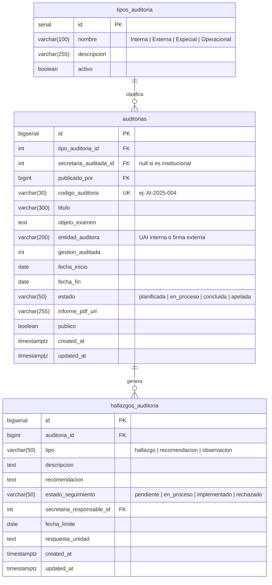
```mermaid
erDiagram
    tipos_auditoria {
        serial id PK
        varchar(100) nombre "Interna | Externa | Especial | Operacional"
        varchar(255) descripcion
        boolean activo
    }

    auditorias {
        bigserial id PK
        int tipo_auditoria_id FK
        int secretaria_auditada_id FK "null si es institucional"
        bigint publicado_por FK
        varchar(30) codigo_auditoria UK "ej: AI-2025-004"
        varchar(300) titulo
        text objeto_examen
        varchar(200) entidad_auditora "UAI interna o firma externa"
        int gestion_auditada
        date fecha_inicio
        date fecha_fin
        varchar(50) estado "planificada | en_proceso | concluida | apelada"
        varchar(255) informe_pdf_url
        boolean publico
        timestamptz created_at
        timestamptz updated_at
    }

    hallazgos_auditoria {
        bigserial id PK
        bigint auditoria_id FK
        varchar(50) tipo "hallazgo | recomendacion | observacion"
        text descripcion
        text recomendacion
        varchar(50) estado_seguimiento "pendiente | en_proceso | implementado | rechazado"
        int secretaria_responsable_id FK
        date fecha_limite
        text respuesta_unidad
        timestamptz created_at
        timestamptz updated_at
    }

    tipos_auditoria ||--o{ auditorias : "clasifica"
    auditorias ||--o{ hallazgos_auditoria : "genera"
```

### Descripción de tablas

| Tabla | Propósito |
| ----- | --------- |
| `tipos_auditoria` | Tipos: Auditoría Interna, Externa, Especial, Operacional |
| `auditorias` | Registro de cada proceso de auditoría con informe descargable y estado de publicación |
| `hallazgos_auditoria` | Hallazgos, observaciones y recomendaciones de cada auditoría con seguimiento de implementación |

---

## Resumen General

### Total de tablas: 65

| # | Módulo | # Tablas |
| - | ------ | -------- |
| 1 | Usuarios y Autenticación | 6 |
| 2 | Configuración del Sitio | 5 |
| 3 | Autoridades e Institucional | 4 |
| 4 | Noticias y Comunicados | 6 |
| 5 | Agenda Institucional | 2 |
| 6 | Normativa | 2 |
| 7 | Trámites y Servicios | 5 |
| 8 | POA y Presupuesto | 6 |
| 9 | Gobierno Abierto y Transparencia | 5 |
| 10 | Participación Ciudadana | 5 |
| 11 | Solicitudes de Información Pública | 2 |
| 12 | Contacto y Directorio | 2 |
| 13 | Recursos Humanos | 3 |
| 14 | Contenido Institucional | 4 |
| 15 | Auditorías | 3 |
| | **TOTAL** | **65** |

### Convenciones usadas

| Símbolo | Significado |
| ------- | ----------- |
| `PK` | Primary Key — clave primaria |
| `FK` | Foreign Key — clave foránea |
| `UK` | Unique Key — valor único |
| `||--o{` | Uno a muchos (obligatorio — opcional) |
| `||--||` | Uno a uno |
| `o{--o{` | Muchos a muchos |
| `bigserial` | Entero auto-incremental de 64 bits (PostgreSQL) |
| `serial` | Entero auto-incremental de 32 bits |
| `timestamptz` | Timestamp con zona horaria |
| `deleted_at` | Soft delete — registro lógico sin borrado físico |

### Principios de diseño aplicados

- **Soft delete** en entidades críticas (`usuarios`, `noticias`) para preservar integridad referencial
- **Trazabilidad** mediante campos `created_at`, `updated_at`, `creado_por`, `actualizado_por`
- **Slugs únicos** para URLs amigables con SEO en contenidos públicos
- **Geolocalización** (latitud/longitud) en eventos y subalcaldías
- **Estados con enum-like** para flujos de trabajo controlados (trámites, POA, normativa)
- **Normalización 3FN** para evitar redundancia, con desnormalización puntual en contadores (vistas, descargas, votos)

---

## 17. Estrategia de Optimización — Slugs, Búsqueda Full-Text e Índices

> Esta sección define las mejoras necesarias para garantizar **URLs semánticas SEO-friendly**, un **buscador institucional de alta velocidad** y una **base de datos optimizada** para tiempos de respuesta bajos en el portal web.

---

### 17.1 Extensiones PostgreSQL requeridas

Instalar una sola vez en la base de datos antes de aplicar cualquier optimización.

```sql
-- Búsqueda por similitud fonética y autocompletado (LIKE, typos)
CREATE EXTENSION IF NOT EXISTS pg_trgm;

-- Normalización de tildes: buscar "tramites" y encontrar "trámites"
CREATE EXTENSION IF NOT EXISTS unaccent;

-- Configuración de búsqueda full-text en español sin tildes
CREATE TEXT SEARCH CONFIGURATION IF NOT EXISTS spanish_unaccent (COPY = spanish);
ALTER TEXT SEARCH CONFIGURATION spanish_unaccent
    ALTER MAPPING FOR hword, hword_part, word
    WITH unaccent, spanish_stem;
```

| Extensión | Propósito |
| --------- | --------- |
| `pg_trgm` | Índices para `ILIKE`, autocompletado y tolerancia a errores tipográficos |
| `unaccent` | Elimina tildes para que "trámites" = "tramites" en búsquedas |
| `spanish_unaccent` | Configuración FTS en español + unaccent combinados |

---

### 17.2 Slugs — URLs semánticas y SEO

Un **slug** es el identificador legible de una entidad en la URL (ej: `obras-publicas-2026`). Permite URLs limpias, mejora el posicionamiento SEO y evita exponer IDs numéricos.

#### Tablas que ya cuentan con slug

| Tabla | Campo |
| ----- | ----- |
| `categorias_noticia` | `slug VARCHAR(100) UNIQUE` |
| `etiquetas` | `slug VARCHAR(80) UNIQUE` |
| `noticias` | `slug VARCHAR(300) UNIQUE` |
| `comunicados` | `slug VARCHAR(300) UNIQUE` |
| `tipos_tramite` | `slug VARCHAR(100)` |
| `tramites_catalogo` | `slug VARCHAR(300) UNIQUE` |

#### Tablas que requieren agregar slug

Las siguientes tablas tienen páginas públicas pero carecen del campo `slug`. Se deben agregar mediante migración:

| Tabla | Tipo | URL resultante |
| ----- | ---- | -------------- |
| `secretarias` | `VARCHAR(200) UNIQUE` | `/institucional/secretarias/{slug}` |
| `subsenefcos` | `VARCHAR(200) UNIQUE` | `/subsenefcos/{slug}` |
| `eventos` | `VARCHAR(350) UNIQUE` | `/agenda/{slug}` |
| `normas` | `VARCHAR(450) UNIQUE` | `/normativa/{slug}` |
| `tipos_norma` | `VARCHAR(100) UNIQUE` | Filtro `/normativa/{slug-tipo}` |
| `auditorias` | `VARCHAR(350) UNIQUE` | `/transparencia/auditorias/{slug}` |
| `documentos_transparencia` | `VARCHAR(350) UNIQUE` | `/transparencia/documentos/{slug}` |
| `autoridades` | `VARCHAR(250) UNIQUE` | `/autoridades/{slug}` |
| `audiencias_publicas` | `VARCHAR(350) UNIQUE` | `/participacion/audiencias/{slug}` |

**Migración SQL:**

```sql
ALTER TABLE secretarias             ADD COLUMN IF NOT EXISTS slug VARCHAR(200) UNIQUE;
ALTER TABLE subsenefcos            ADD COLUMN IF NOT EXISTS slug VARCHAR(200) UNIQUE;
ALTER TABLE eventos                 ADD COLUMN IF NOT EXISTS slug VARCHAR(350) UNIQUE;
ALTER TABLE normas                  ADD COLUMN IF NOT EXISTS slug VARCHAR(450) UNIQUE;
ALTER TABLE tipos_norma             ADD COLUMN IF NOT EXISTS slug VARCHAR(100) UNIQUE;
ALTER TABLE auditorias              ADD COLUMN IF NOT EXISTS slug VARCHAR(350) UNIQUE;
ALTER TABLE documentos_transparencia ADD COLUMN IF NOT EXISTS slug VARCHAR(350) UNIQUE;
ALTER TABLE autoridades             ADD COLUMN IF NOT EXISTS slug VARCHAR(250) UNIQUE;
ALTER TABLE audiencias_publicas     ADD COLUMN IF NOT EXISTS slug VARCHAR(350) UNIQUE;
```

#### Función generadora de slug

Convierte cualquier texto en un slug válido, eliminando tildes, caracteres especiales y espacios.

```sql
CREATE OR REPLACE FUNCTION generar_slug(texto TEXT)
RETURNS TEXT AS $$
DECLARE
    resultado TEXT;
BEGIN
    resultado := unaccent(texto);                                        -- quitar tildes
    resultado := lower(resultado);                                       -- minúsculas
    resultado := regexp_replace(resultado, '[^a-z0-9\s-]', '', 'g');    -- solo alfanumérico
    resultado := regexp_replace(resultado, '[\s-]+', '-', 'g');         -- espacios → guión
    resultado := trim('-' FROM resultado);                               -- limpiar extremos
    RETURN resultado;
END;
$$ LANGUAGE plpgsql IMMUTABLE;

-- Ejemplos:
-- generar_slug('Secretaría de Obras Públicas')   → 'secretaria-de-obras-publicas'
-- generar_slug('Ley Municipal Nº 001/2026')       → 'ley-municipal-n-001-2026'
-- generar_slug('Trámites de Catastro Urbano')     → 'tramites-de-catastro-urbano'
```

> **Nota:** En Laravel se recomienda usar el helper `Str::slug()` al crear/editar registros en los Observers o Mutators del modelo, usando esta misma función en la migración para poblar slugs de registros existentes.

---

### 17.3 Búsqueda Full-Text (tsvector + GIN)

PostgreSQL permite indexar texto en múltiples idiomas con pesos de relevancia. Se agrega una columna `search_vector TSVECTOR` a cada tabla buscable, actualizada automáticamente mediante triggers.

#### Sistema de pesos de relevancia

| Peso | Significado | Ejemplo |
| ---- | ----------- | ------- |
| **A** | Máxima relevancia | Título de la noticia, nombre del trámite |
| **B** | Alta relevancia | Resumen, entradilla, palabras clave |
| **C** | Relevancia media | Cuerpo del texto, procedimiento, atribuciones |

#### Tablas buscables y sus campos indexados

| Tabla | Peso A | Peso B | Peso C |
| ----- | ------ | ------ | ------ |
| `noticias` | `titulo` | `entradilla` | `cuerpo` |
| `comunicados` | `titulo` | — | `contenido` |
| `normas` | `titulo` | `resumen`, `palabras_clave` | `texto_completo` |
| `tramites_catalogo` | `nombre` | `descripcion` | `procedimiento` |
| `eventos` | `titulo` | `descripcion` | `lugar` |
| `secretarias` | `nombre`, `sigla` | — | `atribuciones` |
| `autoridades` | `nombre + apellido` | `cargo` | `perfil_profesional` |
| `documentos_transparencia` | `titulo` | `descripcion` | — |

#### Implementación completa (patrón para todas las tablas)

```sql
-- ── NOTICIAS ──────────────────────────────────────────────────────────────────
ALTER TABLE noticias ADD COLUMN IF NOT EXISTS search_vector TSVECTOR;

CREATE OR REPLACE FUNCTION fn_search_noticias() RETURNS TRIGGER AS $$
BEGIN
    NEW.search_vector :=
        setweight(to_tsvector('spanish_unaccent', COALESCE(NEW.titulo, '')), 'A') ||
        setweight(to_tsvector('spanish_unaccent', COALESCE(NEW.entradilla, '')), 'B') ||
        setweight(to_tsvector('spanish_unaccent', COALESCE(NEW.cuerpo, '')), 'C');
    RETURN NEW;
END;
$$ LANGUAGE plpgsql;

CREATE TRIGGER trg_search_noticias
    BEFORE INSERT OR UPDATE OF titulo, entradilla, cuerpo ON noticias
    FOR EACH ROW EXECUTE FUNCTION fn_search_noticias();

-- ── COMUNICADOS ───────────────────────────────────────────────────────────────
ALTER TABLE comunicados ADD COLUMN IF NOT EXISTS search_vector TSVECTOR;

CREATE OR REPLACE FUNCTION fn_search_comunicados() RETURNS TRIGGER AS $$
BEGIN
    NEW.search_vector :=
        setweight(to_tsvector('spanish_unaccent', COALESCE(NEW.titulo, '')), 'A') ||
        setweight(to_tsvector('spanish_unaccent', COALESCE(NEW.contenido, '')), 'C');
    RETURN NEW;
END;
$$ LANGUAGE plpgsql;

CREATE TRIGGER trg_search_comunicados
    BEFORE INSERT OR UPDATE OF titulo, contenido ON comunicados
    FOR EACH ROW EXECUTE FUNCTION fn_search_comunicados();

-- ── NORMAS ────────────────────────────────────────────────────────────────────
ALTER TABLE normas ADD COLUMN IF NOT EXISTS search_vector TSVECTOR;

CREATE OR REPLACE FUNCTION fn_search_normas() RETURNS TRIGGER AS $$
BEGIN
    NEW.search_vector :=
        setweight(to_tsvector('spanish_unaccent', COALESCE(NEW.titulo, '')), 'A') ||
        setweight(to_tsvector('spanish_unaccent', COALESCE(NEW.resumen, '')), 'B') ||
        setweight(to_tsvector('spanish_unaccent', COALESCE(NEW.palabras_clave, '')), 'B') ||
        setweight(to_tsvector('spanish_unaccent', COALESCE(NEW.texto_completo, '')), 'C');
    RETURN NEW;
END;
$$ LANGUAGE plpgsql;

CREATE TRIGGER trg_search_normas
    BEFORE INSERT OR UPDATE OF titulo, resumen, palabras_clave, texto_completo ON normas
    FOR EACH ROW EXECUTE FUNCTION fn_search_normas();

-- ── TRÁMITES ──────────────────────────────────────────────────────────────────
ALTER TABLE tramites_catalogo ADD COLUMN IF NOT EXISTS search_vector TSVECTOR;

CREATE OR REPLACE FUNCTION fn_search_tramites() RETURNS TRIGGER AS $$
BEGIN
    NEW.search_vector :=
        setweight(to_tsvector('spanish_unaccent', COALESCE(NEW.nombre, '')), 'A') ||
        setweight(to_tsvector('spanish_unaccent', COALESCE(NEW.descripcion, '')), 'B') ||
        setweight(to_tsvector('spanish_unaccent', COALESCE(NEW.procedimiento, '')), 'C');
    RETURN NEW;
END;
$$ LANGUAGE plpgsql;

CREATE TRIGGER trg_search_tramites
    BEFORE INSERT OR UPDATE OF nombre, descripcion, procedimiento ON tramites_catalogo
    FOR EACH ROW EXECUTE FUNCTION fn_search_tramites();

-- ── EVENTOS ───────────────────────────────────────────────────────────────────
ALTER TABLE eventos ADD COLUMN IF NOT EXISTS search_vector TSVECTOR;

CREATE OR REPLACE FUNCTION fn_search_eventos() RETURNS TRIGGER AS $$
BEGIN
    NEW.search_vector :=
        setweight(to_tsvector('spanish_unaccent', COALESCE(NEW.titulo, '')), 'A') ||
        setweight(to_tsvector('spanish_unaccent', COALESCE(NEW.descripcion, '')), 'B') ||
        setweight(to_tsvector('spanish_unaccent', COALESCE(NEW.lugar, '')), 'C');
    RETURN NEW;
END;
$$ LANGUAGE plpgsql;

CREATE TRIGGER trg_search_eventos
    BEFORE INSERT OR UPDATE OF titulo, descripcion, lugar ON eventos
    FOR EACH ROW EXECUTE FUNCTION fn_search_eventos();

-- ── SECRETARIAS ───────────────────────────────────────────────────────────────
ALTER TABLE secretarias ADD COLUMN IF NOT EXISTS search_vector TSVECTOR;

CREATE OR REPLACE FUNCTION fn_search_secretarias() RETURNS TRIGGER AS $$
BEGIN
    NEW.search_vector :=
        setweight(to_tsvector('spanish_unaccent', COALESCE(NEW.nombre, '')), 'A') ||
        setweight(to_tsvector('spanish_unaccent', COALESCE(NEW.sigla, '')), 'A') ||
        setweight(to_tsvector('spanish_unaccent', COALESCE(NEW.atribuciones, '')), 'C');
    RETURN NEW;
END;
$$ LANGUAGE plpgsql;

CREATE TRIGGER trg_search_secretarias
    BEFORE INSERT OR UPDATE OF nombre, sigla, atribuciones ON secretarias
    FOR EACH ROW EXECUTE FUNCTION fn_search_secretarias();

-- ── AUTORIDADES ───────────────────────────────────────────────────────────────
ALTER TABLE autoridades ADD COLUMN IF NOT EXISTS search_vector TSVECTOR;

CREATE OR REPLACE FUNCTION fn_search_autoridades() RETURNS TRIGGER AS $$
BEGIN
    NEW.search_vector :=
        setweight(to_tsvector('spanish_unaccent',
            COALESCE(NEW.nombre,'') || ' ' || COALESCE(NEW.apellido,'')), 'A') ||
        setweight(to_tsvector('spanish_unaccent', COALESCE(NEW.cargo, '')), 'B') ||
        setweight(to_tsvector('spanish_unaccent', COALESCE(NEW.perfil_profesional, '')), 'C');
    RETURN NEW;
END;
$$ LANGUAGE plpgsql;

CREATE TRIGGER trg_search_autoridades
    BEFORE INSERT OR UPDATE OF nombre, apellido, cargo, perfil_profesional ON autoridades
    FOR EACH ROW EXECUTE FUNCTION fn_search_autoridades();

-- ── DOCUMENTOS DE TRANSPARENCIA ───────────────────────────────────────────────
ALTER TABLE documentos_transparencia ADD COLUMN IF NOT EXISTS search_vector TSVECTOR;

CREATE OR REPLACE FUNCTION fn_search_docs_transparencia() RETURNS TRIGGER AS $$
BEGIN
    NEW.search_vector :=
        setweight(to_tsvector('spanish_unaccent', COALESCE(NEW.titulo, '')), 'A') ||
        setweight(to_tsvector('spanish_unaccent', COALESCE(NEW.descripcion, '')), 'B');
    RETURN NEW;
END;
$$ LANGUAGE plpgsql;

CREATE TRIGGER trg_search_docs_transparencia
    BEFORE INSERT OR UPDATE OF titulo, descripcion ON documentos_transparencia
    FOR EACH ROW EXECUTE FUNCTION fn_search_docs_transparencia();

-- ── POBLAR REGISTROS EXISTENTES (ejecutar una sola vez) ───────────────────────
UPDATE noticias              SET titulo = titulo;
UPDATE comunicados           SET titulo = titulo;
UPDATE normas                SET titulo = titulo;
UPDATE tramites_catalogo     SET nombre = nombre;
UPDATE eventos               SET titulo = titulo;
UPDATE secretarias           SET nombre = nombre;
UPDATE autoridades           SET nombre = nombre;
UPDATE documentos_transparencia SET titulo = titulo;
```

#### Índices GIN para Full-Text Search

```sql
CREATE INDEX IF NOT EXISTS idx_fts_noticias        ON noticias              USING GIN (search_vector);
CREATE INDEX IF NOT EXISTS idx_fts_comunicados     ON comunicados           USING GIN (search_vector);
CREATE INDEX IF NOT EXISTS idx_fts_normas          ON normas                USING GIN (search_vector);
CREATE INDEX IF NOT EXISTS idx_fts_tramites        ON tramites_catalogo     USING GIN (search_vector);
CREATE INDEX IF NOT EXISTS idx_fts_eventos         ON eventos               USING GIN (search_vector);
CREATE INDEX IF NOT EXISTS idx_fts_secretarias     ON secretarias           USING GIN (search_vector);
CREATE INDEX IF NOT EXISTS idx_fts_autoridades     ON autoridades           USING GIN (search_vector);
CREATE INDEX IF NOT EXISTS idx_fts_docs_trans      ON documentos_transparencia USING GIN (search_vector);
```

#### Índices GIN para Trigrama (autocompletado y typos)

```sql
CREATE INDEX IF NOT EXISTS idx_trgm_noticias_titulo    ON noticias         USING GIN (titulo gin_trgm_ops);
CREATE INDEX IF NOT EXISTS idx_trgm_comunicados_titulo ON comunicados      USING GIN (titulo gin_trgm_ops);
CREATE INDEX IF NOT EXISTS idx_trgm_normas_titulo      ON normas           USING GIN (titulo gin_trgm_ops);
CREATE INDEX IF NOT EXISTS idx_trgm_normas_keywords    ON normas           USING GIN (palabras_clave gin_trgm_ops);
CREATE INDEX IF NOT EXISTS idx_trgm_tramites_nombre    ON tramites_catalogo USING GIN (nombre gin_trgm_ops);
CREATE INDEX IF NOT EXISTS idx_trgm_eventos_titulo     ON eventos          USING GIN (titulo gin_trgm_ops);
CREATE INDEX IF NOT EXISTS idx_trgm_secretarias_nombre ON secretarias      USING GIN (nombre gin_trgm_ops);
```

---

### 17.4 Buscador Global Unificado

Vista y función que permiten buscar en todas las entidades públicas del portal con una sola consulta, retornando resultados ordenados por relevancia.

#### Vista `v_busqueda_global`

```sql
CREATE OR REPLACE VIEW v_busqueda_global AS

    SELECT 'noticia' AS tipo, id::TEXT AS id, titulo,
           entradilla AS descripcion, slug, '/noticias/' AS base_url,
           fecha_publicacion AS fecha, search_vector AS vector
    FROM noticias
    WHERE estado = 'publicado' AND deleted_at IS NULL

    UNION ALL

    SELECT 'comunicado', id::TEXT, titulo, NULL,
           slug, '/comunicados/', fecha_publicacion, search_vector
    FROM comunicados WHERE estado = 'publicado'

    UNION ALL

    SELECT 'norma', id::TEXT, titulo, resumen,
           slug, '/normativa/', fecha_promulgacion::TIMESTAMPTZ, search_vector
    FROM normas WHERE estado_vigencia != 'derogado'

    UNION ALL

    SELECT 'tramite', id::TEXT, nombre, descripcion,
           slug, '/tramites/', created_at, search_vector
    FROM tramites_catalogo WHERE activo = TRUE

    UNION ALL

    SELECT 'evento', id::TEXT, titulo, descripcion,
           slug, '/agenda/', fecha_inicio, search_vector
    FROM eventos WHERE publico = TRUE AND estado IN ('programado', 'realizado')

    UNION ALL

    SELECT 'documento', id::TEXT, titulo, descripcion,
           slug, '/transparencia/documentos/', fecha_publicacion::TIMESTAMPTZ, search_vector
    FROM documentos_transparencia WHERE activo = TRUE

    UNION ALL

    SELECT 'secretaria', id::TEXT, nombre, atribuciones,
           slug, '/institucional/secretarias/', created_at, search_vector
    FROM secretarias WHERE activa = TRUE

    UNION ALL

    SELECT 'tramite_tipo', id::TEXT, nombre, NULL,
           slug, '/tramites/categoria/', created_at, NULL
    FROM tipos_tramite WHERE activo = TRUE;
```

#### Función `buscar_global()`

```sql
CREATE OR REPLACE FUNCTION buscar_global(
    termino   TEXT,
    limite    INT DEFAULT 10,
    desplazar INT DEFAULT 0
)
RETURNS TABLE (
    tipo        TEXT,
    id          TEXT,
    titulo      TEXT,
    descripcion TEXT,
    url         TEXT,
    fecha       TIMESTAMPTZ,
    relevancia  FLOAT4
) AS $$
DECLARE
    query_ts TSQUERY;
BEGIN
    query_ts := websearch_to_tsquery('spanish_unaccent', termino);

    RETURN QUERY
    SELECT
        bg.tipo,
        bg.id,
        bg.titulo,
        bg.descripcion,
        bg.base_url || COALESCE(bg.slug, bg.id) AS url,
        bg.fecha,
        ts_rank_cd(bg.vector, query_ts)          AS relevancia
    FROM v_busqueda_global bg
    WHERE bg.vector @@ query_ts
    ORDER BY relevancia DESC, bg.fecha DESC
    LIMIT limite
    OFFSET desplazar;
END;
$$ LANGUAGE plpgsql STABLE;
```

**Ejemplos de uso:**

```sql
-- Búsqueda simple
SELECT * FROM buscar_global('obras publicas');

-- Búsqueda paginada (página 2, 10 por página)
SELECT * FROM buscar_global('licencia funcionamiento', 10, 10);

-- Solo noticias
SELECT * FROM buscar_global('salud') WHERE tipo = 'noticia';

-- Solo trámites y normas
SELECT * FROM buscar_global('catastro') WHERE tipo IN ('tramite', 'norma');

-- Autocompletado con trigrama (tolerante a errores)
SELECT titulo, slug
FROM noticias
WHERE titulo ILIKE '%obra%' AND estado = 'publicado'
ORDER BY similarity(titulo, 'obras') DESC
LIMIT 5;

-- Tolerancia a typos (ej: "contratacion" → "contratación")
SELECT titulo, slug FROM normas
WHERE titulo % 'contratacion'
ORDER BY titulo <-> 'contratacion'
LIMIT 5;
```

---

### 17.5 Índices de Performance (B-tree)

Los índices **parciales** (`WHERE`) excluyen filas inactivas o eliminadas, reduciendo el tamaño del índice y acelerando las consultas de listado público.

```sql
-- ── NOTICIAS ──────────────────────────────────────────────────────────────────
-- Listado público ordenado por fecha
CREATE INDEX IF NOT EXISTS idx_noticias_estado_fecha
    ON noticias (estado, fecha_publicacion DESC)
    WHERE deleted_at IS NULL;

-- Noticias destacadas para el home
CREATE INDEX IF NOT EXISTS idx_noticias_destacada
    ON noticias (destacada, fecha_publicacion DESC)
    WHERE deleted_at IS NULL AND estado = 'publicado';

-- Noticias por categoría
CREATE INDEX IF NOT EXISTS idx_noticias_categoria
    ON noticias (categoria_id, fecha_publicacion DESC)
    WHERE deleted_at IS NULL AND estado = 'publicado';

-- Noticias más leídas
CREATE INDEX IF NOT EXISTS idx_noticias_vistas
    ON noticias (vistas DESC)
    WHERE deleted_at IS NULL AND estado = 'publicado';

-- ── COMUNICADOS ───────────────────────────────────────────────────────────────
CREATE INDEX IF NOT EXISTS idx_comunicados_estado_fecha
    ON comunicados (estado, fecha_publicacion DESC);

CREATE INDEX IF NOT EXISTS idx_comunicados_tipo
    ON comunicados (tipo, fecha_publicacion DESC)
    WHERE estado = 'publicado';

-- Comunicados vigentes (alertas activas)
CREATE INDEX IF NOT EXISTS idx_comunicados_vigencia
    ON comunicados (fecha_vigencia_hasta)
    WHERE estado = 'publicado';

-- ── NORMAS ────────────────────────────────────────────────────────────────────
CREATE INDEX IF NOT EXISTS idx_normas_tipo_fecha
    ON normas (tipo_norma_id, fecha_promulgacion DESC);

CREATE INDEX IF NOT EXISTS idx_normas_vigencia
    ON normas (estado_vigencia);

CREATE INDEX IF NOT EXISTS idx_normas_vistas
    ON normas (vistas DESC);

-- ── TRÁMITES ──────────────────────────────────────────────────────────────────
CREATE INDEX IF NOT EXISTS idx_tramites_tipo
    ON tramites_catalogo (tipo_tramite_id)
    WHERE activo = TRUE;

CREATE INDEX IF NOT EXISTS idx_tramites_unidad
    ON tramites_catalogo (unidad_responsable_id)
    WHERE activo = TRUE;

CREATE INDEX IF NOT EXISTS idx_tramites_modalidad
    ON tramites_catalogo (modalidad)
    WHERE activo = TRUE;

-- ── EVENTOS ───────────────────────────────────────────────────────────────────
CREATE INDEX IF NOT EXISTS idx_eventos_fecha_inicio
    ON eventos (fecha_inicio DESC);

CREATE INDEX IF NOT EXISTS idx_eventos_estado_fecha
    ON eventos (estado, fecha_inicio)
    WHERE publico = TRUE;

-- ── USUARIOS Y SESIONES ───────────────────────────────────────────────────────
CREATE INDEX IF NOT EXISTS idx_usuarios_email
    ON usuarios (email)
    WHERE deleted_at IS NULL;

CREATE INDEX IF NOT EXISTS idx_usuarios_ci
    ON usuarios (ci)
    WHERE deleted_at IS NULL;

-- Sesiones no vencidas
CREATE INDEX IF NOT EXISTS idx_sesiones_expira
    ON sesiones (expira_at)
    WHERE expira_at > NOW();

-- ── HOME — BANNERS ────────────────────────────────────────────────────────────
CREATE INDEX IF NOT EXISTS idx_banners_activos
    ON banners (activo, orden)
    WHERE activo = TRUE AND (fecha_fin IS NULL OR fecha_fin >= CURRENT_DATE);

-- ── MENÚ ──────────────────────────────────────────────────────────────────────
CREATE INDEX IF NOT EXISTS idx_menu_items_menu
    ON menu_items (menu_id, orden)
    WHERE activo = TRUE;

CREATE INDEX IF NOT EXISTS idx_menu_items_parent
    ON menu_items (parent_id)
    WHERE activo = TRUE;

-- ── RELACIONES MUCHOS A MUCHOS ────────────────────────────────────────────────
CREATE INDEX IF NOT EXISTS idx_noticia_etiquetas_noticia
    ON noticias_etiquetas (noticia_id);

CREATE INDEX IF NOT EXISTS idx_noticia_etiquetas_etiqueta
    ON noticias_etiquetas (etiqueta_id);

-- ── MULTIMEDIA ────────────────────────────────────────────────────────────────
CREATE INDEX IF NOT EXISTS idx_multimedia_noticia
    ON multimedia (noticia_id, orden)
    WHERE noticia_id IS NOT NULL;

CREATE INDEX IF NOT EXISTS idx_multimedia_comunicado
    ON multimedia (comunicado_id, orden)
    WHERE comunicado_id IS NOT NULL;

-- ── POA Y PRESUPUESTO ─────────────────────────────────────────────────────────
CREATE INDEX IF NOT EXISTS idx_poa_secretaria_gestion
    ON poa (secretaria_id, gestion DESC);

CREATE INDEX IF NOT EXISTS idx_presupuesto_secretaria_gestion
    ON presupuestos (secretaria_id, gestion DESC);

CREATE INDEX IF NOT EXISTS idx_ejecucion_partida_mes
    ON ejecucion_presupuestaria (partida_id, gestion, mes);

-- ── TRANSPARENCIA ─────────────────────────────────────────────────────────────
CREATE INDEX IF NOT EXISTS idx_docs_trans_tipo_gestion
    ON documentos_transparencia (tipo_documento_id, gestion DESC)
    WHERE activo = TRUE;

CREATE INDEX IF NOT EXISTS idx_docs_trans_secretaria
    ON documentos_transparencia (secretaria_id, gestion DESC)
    WHERE activo = TRUE;

-- ── INDICADORES — DASHBOARD CIUDADANO ─────────────────────────────────────────
CREATE INDEX IF NOT EXISTS idx_indicadores_dashboard
    ON indicadores_gestion (orden_dashboard)
    WHERE publico = TRUE AND activo = TRUE;

CREATE INDEX IF NOT EXISTS idx_valores_indicador
    ON valores_indicador (indicador_id, gestion DESC, mes DESC);

-- ── AUDITORÍAS ────────────────────────────────────────────────────────────────
CREATE INDEX IF NOT EXISTS idx_auditorias_estado
    ON auditorias (estado, publico);

CREATE INDEX IF NOT EXISTS idx_hallazgos_estado
    ON hallazgos_auditoria (estado_seguimiento)
    WHERE estado_seguimiento != 'implementado';

-- ── RECURSOS HUMANOS ──────────────────────────────────────────────────────────
CREATE INDEX IF NOT EXISTS idx_nomina_secretaria_gestion
    ON nomina_personal (secretaria_id, gestion DESC)
    WHERE activo = TRUE;

CREATE INDEX IF NOT EXISTS idx_manuales_tipo_gestion
    ON manuales_institucionales (tipo, gestion DESC)
    WHERE vigente = TRUE;

CREATE INDEX IF NOT EXISTS idx_escala_salarial_gestion
    ON escala_salarial (gestion DESC)
    WHERE vigente = TRUE;

-- ── PARTICIPACIÓN CIUDADANA ───────────────────────────────────────────────────
CREATE INDEX IF NOT EXISTS idx_consultas_activas
    ON consultas_ciudadanas (activa, fecha_fin)
    WHERE activa = TRUE;

CREATE INDEX IF NOT EXISTS idx_sugerencias_estado
    ON sugerencias (estado, created_at DESC);

-- ── SOLICITUDES DE INFORMACIÓN ────────────────────────────────────────────────
CREATE INDEX IF NOT EXISTS idx_solicitudes_estado
    ON solicitudes_informacion (estado, fecha_limite_respuesta);

-- ── MENSAJES DE CONTACTO ──────────────────────────────────────────────────────
CREATE INDEX IF NOT EXISTS idx_mensajes_estado
    ON mensajes_contacto (estado, created_at DESC);
```

---

### 17.6 Resumen de mejoras aplicadas

| Categoría | Cantidad |
| --------- | -------- |
| Slugs nuevos agregados | 9 tablas |
| Columnas `search_vector` (tsvector) | 8 tablas |
| Triggers de auto-actualización | 8 triggers |
| Índices GIN full-text | 8 índices |
| Índices GIN trigrama (autocompletado) | 7 índices |
| Índices B-tree de performance | 35+ índices |
| Vistas de búsqueda global | 1 vista |
| Funciones utilitarias | 2 funciones |

> **Impacto esperado:** Las consultas de listado público pasan de escaneo secuencial (`Seq Scan`) a uso de índice (`Index Scan`), reduciendo los tiempos de respuesta de la API de cientos de milisegundos a menos de 5 ms en tablas con miles de registros.
